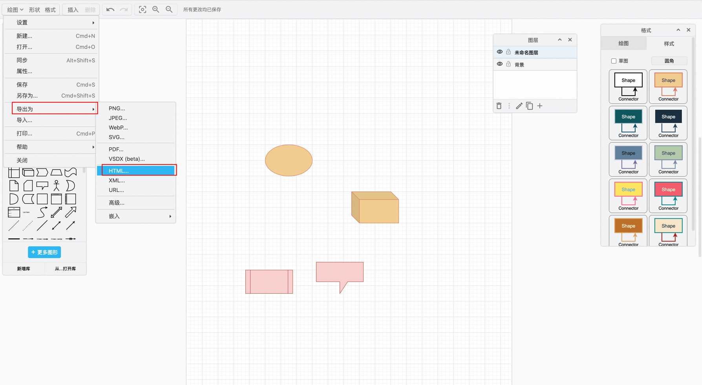
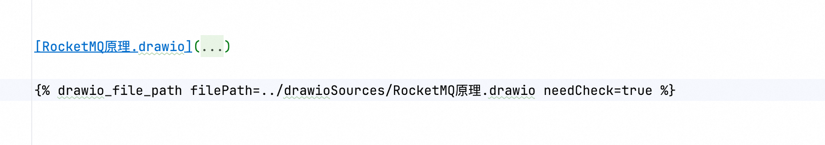

# hexo-drawio


A Hexo plugin, used to embed drawio files everywhere locally


# Usage
## 1、edit and export

Use desktop or online editing

After editing, export to HTML format




## Integrated into Hexo

use hexo's tag **drawio_file_path** 
```

```



## Example

after generate static files. it looks like


# Detail

see detail : https://github.com/wanglikang/hexo-drawio

